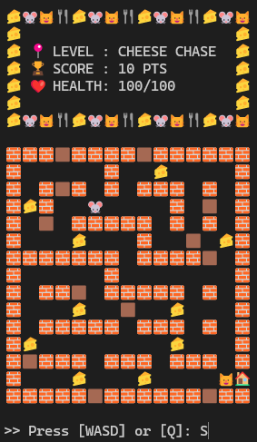
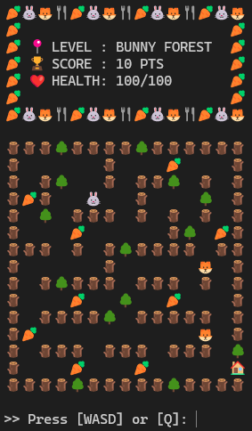
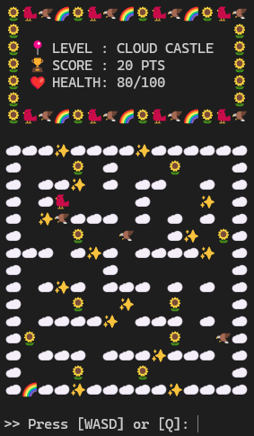
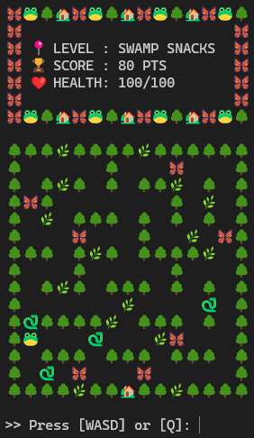
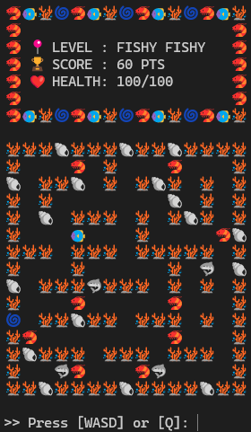
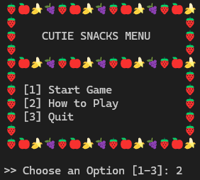
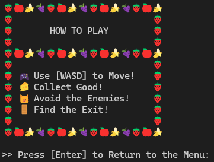

# Cutie Snacks

Cutie Snacks is a console-based maze game built inspired by PacMan, using the Java programming language. The game challenges the player to navigate through different maze levels, collect food, avoid enemies, and reach the exit. Each level introduces a different theme, player character, enemies, food, and maze design, with the difficulty increasing as the player progresses.

The game is organized using object-oriented programming principles and separates gameplay responsibilities into different classes, including the game controller, levels, player, enemies, game objects, maze builder, and console UI.

### Game Features

* **Multiple Levels:** Players progress through five different themed levels.
* **Maze Navigation:** Players use **WASD** controls to navigate through the maze.
* **Food Collection:** Players collect food throughout each maze to earn points.
* **Enemies:** Players must avoid enemies that move throughout the maze and reduce player health upon collision.
* **Health System:** Players have a limited amount of health and lose health when hit by enemies.
* **Level Progression:** Completing a level allows the player to advance to the next level.
* **Increasing Difficulty:** Each level introduces additional enemies and different maze challenges.
* **Themed Levels:** Each level uses different characters, enemies, food, and wall designs.
* **Console UI:** The game displays the current level, score, health, maze, and gameplay instructions directly in the console.

### Level 1 — [Cheese Chase]

* Player: 🐭 Mouse
* Enemy: 🐱 x 1
* Food: 🧀 Cheese
* Walls: 🧱 / 🪵
* Exit: 🚪



### Level 2 — [Bunny Forest]

* Player: 🐰
* Enemy: 🦊 x 2
* Food: 🥕
* Walls: 🪵 / 🌳
* Exit: 🏠



### Level 3 — [Cloud Castle]

* Player: 🐦
* Enemy: 🦅 x 3
* Food: 🌻
* Walls: ☁️ / ✨
* Exit: 🌈



### Level 4 — [Swamp Snacks]

* Player: 🐸
* Enemy: 🐍 x 3
* Food: 🦋
* Walls: 🌳 / 🌿
* Exit: 🏡



### Level 5 — [Fishy Fishy]

* Player: 🐠
* Enemy: 🦈 x 4
* Food: 🦐
* Walls: 🪸 / 🐚
* Exit: 🌀



### Game Menu

The main menu allows the player to:

* **Start Game:** Begin the game and play through the available levels.
* **How to Play:** View the game controls and instructions.
* **Exit:** Exit the game. 





### Gameplay

The player begins each level with a set amount of health and must navigate the maze while collecting food and avoiding enemies. Walls prevent the player from moving through blocked areas. Reaching the exit completes the current level and allows the player to continue to the next level.

If the player's health reaches zero, the game ends with a **Game Over**. Successfully completing the final level results in a **You Win** message.

### Game Display

The game displays the current gameplay information at the top of the console, including:

* 📍 Current Level
* 🏆 Score
* ❤️ Health

The maze is displayed underneath the status information using emojis to represent the player, enemies, food, walls, and exit.

### Controls

```text
W → Move Up
A → Move Left
S → Move Down
D → Move Right
Q → Quit Game
```

###  How to Run

Open Bash in the project directory containing the src folder, then run:
```text
> javac -encoding UTF-8 -d bin $(find src -name "*.java")
> java -cp bin Main
```

###  What These Commands Do
* Compile all Java source files in the src directory and its subdirectories using UTF-8 encoding.
* Place the compiled .class files into the bin directory.
* Run the game through the Main class.
* The -encoding UTF-8 option ensures the game's emoji characters are compiled correctly.
* The find command automatically includes Java files from all project packages, including entities, game, levels, objects, and pathfinding.

###  Requirements
* Java JDK 25 or later
* Bash / WSL environment